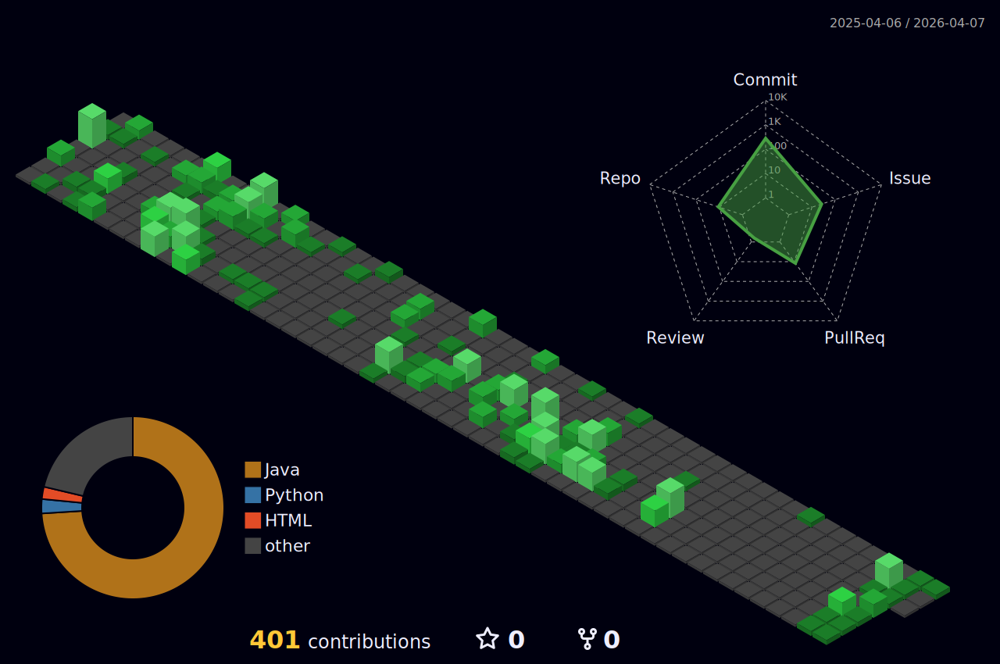

<h3 align="center">I am a student majoring in Artificial Intelligence Software at Cheongju University.</h3>

<h3 align="left">Languages and Tools:</h3>

 

   
  
  

  

  

  

  

  

   

  

   

   

  

   
  
  
  
 &nbsp;&nbsp;&nbsp;
<picture>
  <source
    srcset="https://github-readme-stats.vercel.app/api/top-langs/?username=InCaelus&show_icons=true&theme=dark"
    media="(prefers-color-scheme: dark)"
  />
  <source
    srcset="https://github-readme-stats.vercel.app/api?username=InCaelus&show_icons=true"
    media="(prefers-color-scheme: light), (prefers-color-scheme: no-preference)"
  />
</picture>

