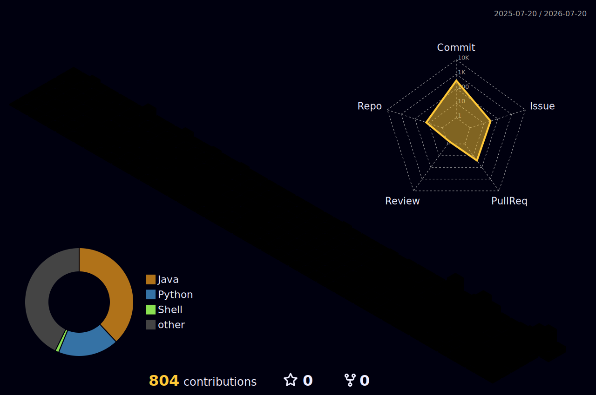

## 👋 About Me

안녕하세요, **InCaelus** 입니다.

**소프트웨어**를 주전공, **디지털보안**을 복수전공으로 공부하고 있어요.

화려한 겉모습보다 **데이터를 안전하게 다루는 견고한 백엔드**에 소프트웨어의 진짜 가치가 있다고 믿습니다.
AI가 빠르게 발전하는 만큼 개인정보 유출·보안 위협이라는 그림자도 커진다고 생각하여, **"보안은 선택이 아니라 필수"** 라는 마음으로 보안을 함께 파고 있어요.

프론트엔드 · 백엔드 · 인프라까지 모든 레이어가 조화를 이뤄야 좋은 소프트웨어가 된다고 보고,
화면 아래에서 흐르는 **데이터의 무결성과 안전까지 책임지는 시큐어 풀스택 엔지니어(Secure Full-Stack Engineer)** 를 목표로 합니다.

---

## 🔭 Current Focus

- 보안 중심의 풀스택 개발 (Frontend · Backend · Infra)
- 데이터를 안전하게 처리하는 백엔드 설계
- AI 소프트웨어 학습 및 적용
- 가상 환경(Kali · Rocky · Ubuntu) 기반 보안 실습
- 개발 과정 기록 & 꾸준한 성장

---

## 🛠️ Tech Stack

- **Language** : Python · Java · Kotlin · PHP · TypeScript · JavaScript · HTML · CSS
- **Frontend** : React
- **Backend & Data** : Spring Boot · MySQL · Pandas
- **Security & Infra** : VMware (Kali Linux · Rocky Linux · Ubuntu)
- **Tools** : Git · GitHub · IntelliJ · PyCharm · VS Code · Android Studio

---

<picture>
  <source
    srcset="https://github-readme-stats.vercel.app/api/top-langs/?username=InCaelus&show_icons=true&theme=dark"
    media="(prefers-color-scheme: dark)"
  />
  <source
    srcset="https://github-readme-stats.vercel.app/api?username=InCaelus&show_icons=true"
    media="(prefers-color-scheme: light), (prefers-color-scheme: no-preference)"
  />
</picture>
 

